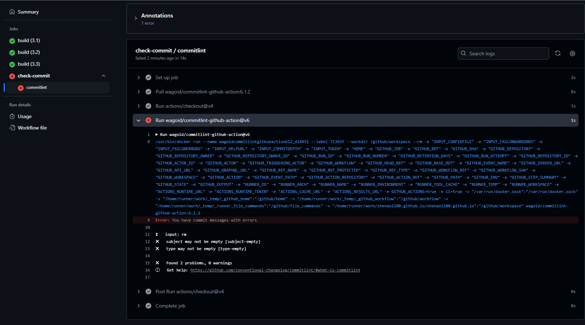

# Commit message中的格式约定

## 起因

在使用Github Action时遇到了这样一个问题：



commitlint报错，查询后得知是由于我的commit message不规范导致的

## Conventional Commits

commitlint 通常会检查提交信息是否符合 Conventional Commits 规范。基本格式如下：

```
<type>(<scope>): <subject>
```

| 键      | 描述                           |
| ------- | ------------------------------ |
| type    | 提交类型（例如 feat、fix 等）  |
| scope   | 可选的，用于描述提交的具体范围 |
| subject | 简短的提交标题，描述提交内容   |

例：

```
feat(login): add user login functionality
```

## 常用类型

| 键       | 描述                                       |
| -------- | ------------------------------------------ |
| feat     | 添加新功能                                 |
| fix      | 修复问题                                   |
| docs     | 修改文档                                   |
| style    | 代码格式（不影响代码运行的更改）           |
| refactor | 重构代码（既不是修复错误也不是添加新功能） |
| test     | 添加测试                                   |
| chore    | 构建过程或辅助工具的变动                   |

