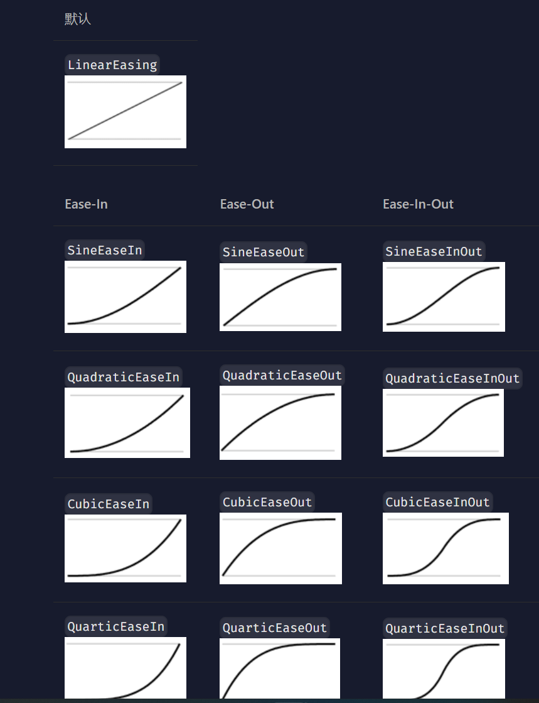

# Avalonia UI关键帧动画(Animation)详解

Animation是Avalonia中用于设置控件动画

此笔记将介绍如何创建如下的动画：


## 组成部分

一个Animation由以下内容组成：
- KeyFrame设置关键帧
  - Cue设置Cue点
    - Setter控制内容变化

`KeyFrame` 很好理解，设置一个运动变化中关键动作所处的那一帧

`Cue` 这是影视剪辑中的一个专有名词(通常被叫做Cue点)，在此处是指明该关键帧何时播放

`Setter` 用于指明控件的属性变化

在Avalonia中可以使用xaml和C#两种方式定义动画，本文着重讲解C#


## C#上手

### 创建一个Panel

```xml
	<Panel Margin="0" x:Name="ContentPanel1">
  <!--一些控件-->
	</Panel>
```

### 了解属性

属性会在`Setter`中用到

针对C#代码，我们使用`<Class>.Property`的方法声明属性

例如需要修改Label的Opacity属性为0就可以使用
```csharp
Setter(UserControl.OpacityProperty, 0.0)
```

> 此处的Class指的是Button, Label, Border, UserControl这些原生类，而不是定义的变量
{: .prompt-info }

### 动画代码

```csharp
var DropAnimation = new Animation // 使用Animation类
{
  Duration = TimeSpan.FromSeconds(0.25),  // 整个动画0.25秒就会播放完毕，除了FromSeconds还有Day Year Miliseconds等可选
  
  Easing = new ExponentialEaseOut(),  // 定义线性或非线性动画，相关的知识可在后文找到
  Children =
  {
      new KeyFrame  // 第一个关键帧
      {
          Cue = new Cue(0), // Cue取值0-1，代表动画播放的百分比，此时为0.25s * 0% = 0s的时候播放该关键帧
          Setters =
          {
              new Setter(UserControl.MarginProperty, new Thickness(0,100,0,0)),   // 定义控件的Margin为0 100 0 0
              new Setter(UserControl.OpacityProperty, 0.0)  // 定义透明度完全透明
          }
      },
      new KeyFrame
      {
          Cue = new Cue(1), // 第0.25秒的关键帧
          Setters =
          {
              new Setter(UserControl.MarginProperty, new Thickness(0)),   // Margin此时变为0 0 0 0
              new Setter(UserControl.OpacityProperty, 1.0)  //定义透明度为不透明
          }
      }
  }
};
```

> 若需要重复播放，可使用 `Animation` 元素上的 `IterationCount` 设置动画要重播的次数。此设置有两种格式:
>
> N（一个整数，代表重复N次）或者 Infinite（永远重复）
{: .prompt-info }

## Xaml上手

在Xaml中，动画和CSS很像，需要定义选择器

> 此处创建了一个UserControl，请根据你的个人情况修改代码
{: .prompt-info }

### 定义要应用动画的控件

此处定义了一个Classes为fly的Panel，这个Classes就是为选择器准备的

```xml
<UserControl xmlns="https://github.com/avaloniaui"
             xmlns:x="http://schemas.microsoft.com/winfx/2006/xaml"
             xmlns:d="http://schemas.microsoft.com/expression/blend/2008"
             xmlns:mc="http://schemas.openxmlformats.org/markup-compatibility/2006"
             xmlns:vm="clr-namespace:Netko.ViewModels"
             mc:Ignorable="d" d:DesignWidth="600" d:DesignHeight="450"
             x:Class="Netko.Views.MainView"
			 x:Name="MainViewPanel">
  <Panel Margin="0" Classes="fly">

  </Panel>
</UserControl>
```

### 动画代码

此处定义了选择器为`Panel.fly`

使用了`Style.Animations`来定义动画

`Animation Duration="0:0:0.5"`代表动画持续0.5秒（0:0:0.5代表时:分:秒）

`<KeyFrame Cue="0%">`设置了关键帧的Cue点为0s时

`<Setter Property="Margin" Value="0 100 0 0"></Setter>`设置了控件的Margin属性为0 100 0 0

```xml
<UserControl.Styles>
	<Style Selector="Panel.fly">
		<Style.Animations>
			<Animation Duration="0:0:0.5">
				<KeyFrame Cue="0%">
					<Setter Property="Margin" Value="0 100 0 0"></Setter>
				</KeyFrame>
				<KeyFrame Cue="100%">
					<Setter Property="Margin" Value="0 0 0 0"></Setter>
				</KeyFrame>
			</Animation>
		</Style.Animations>
	</Style>
</UserControl.Styles>
```

> 若需要重复播放，可使用 `Animation` 元素上的 `IterationCount` 设置动画要重播的次数。此设置有两种格式:
>
> N（一个整数，代表重复N次）或者 Infinite（永远重复）
{: .prompt-info }

### 合起来

在Panel中加入一些元素，启动程序你就能看到Panel的上升动画了

```xml
<UserControl xmlns="https://github.com/avaloniaui"
             xmlns:x="http://schemas.microsoft.com/winfx/2006/xaml"
             xmlns:d="http://schemas.microsoft.com/expression/blend/2008"
             xmlns:mc="http://schemas.openxmlformats.org/markup-compatibility/2006"
             xmlns:vm="clr-namespace:Netko.ViewModels"
             mc:Ignorable="d" d:DesignWidth="600" d:DesignHeight="450"
             x:Class="Netko.Views.MainView"
			 x:Name="MainViewPanel">
  <UserControl.Styles>
	<Style Selector="Panel.fly">
		<Style.Animations>
			<Animation Duration="0:0:0.5">
				<KeyFrame Cue="0%">
					<Setter Property="Margin" Value="0 100 0 0"></Setter>
				</KeyFrame>
				<KeyFrame Cue="100%">
					<Setter Property="Margin" Value="0 0 0 0"></Setter>
				</KeyFrame>
			</Animation>
		</Style.Animations>
	</Style>
  </UserControl.Styles>
  <Panel Margin="0" Classes="fly">
    <Label>Test Content</Label>
  </Panel>
</UserControl>
```

## 什么是线性动画和非线性动画

Avalonia中提供了一种缓动函数

缓动函数描述了动画属性在动画时间内从起始值到结束值的变化速度

直观的表现如下：

非线性的`ExponentialEaseOut`


多了一点"弹跳"效果的`BackEaseOut`


你可以在<a href="https://docs.avaloniaui.net/zh-Hans/docs/reference/animation-settings#%E7%BC%93%E5%8A%A8%E5%87%BD%E6%95%B0easing-functions">这里</a>找到这些函数：



最上方的`LinearEasing`是一条直线，斜率固定

因此动画的速度也是固定的

而其他的函数是曲线，斜率不固定，因此动画的速度有快有慢

善用这些函数可以给程序添加上灵动的视觉效果

## The END

这里差不多就是Animation的用法了，个人用肉眼测得`ExponentialEaseOut`最像WinUI中的动画速度，所以在页面切换的时候使用了该函数
