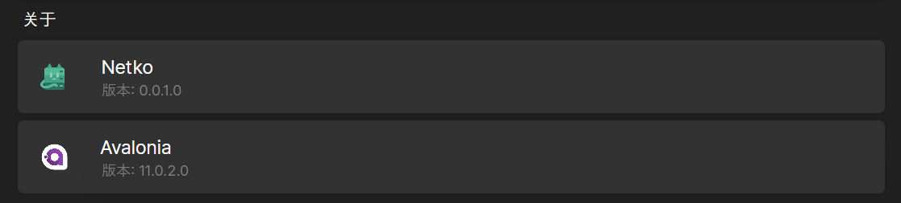
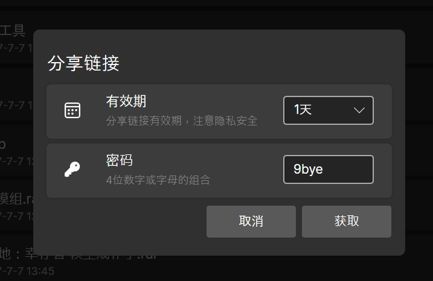

# Avalonia UI实现WinUI中卡片(Card)效果

## 效果





## 代码

> 文中的DynamicResource是一种动态资源，你可以把它替换为任何颜色
> 
> 文中的StaticResource是一种静态资源，你可以创建一个`Style`文件存储这些资源
> 
> 相关的资源文件需自己准备
{: .prompt-info }

### 简单信息显示


```xml
<Grid MinHeight="60" Margin="15 3">
	<Border Background="{DynamicResource CatalogBaseHighColor}" CornerRadius="5" Padding="0" Margin="0" Opacity="1" BoxShadow="0 0 3 1 #20000000">
	</Border>
	<StackPanel>
		<DockPanel>
			<StackPanel VerticalAlignment="Center" DockPanel.Dock="Left" Margin="5">
				<Image Source="/Assets/avalonia.png" Height="23" Width="23" Margin="13"/>
			</StackPanel>
			<StackPanel VerticalAlignment="Center" DockPanel.Dock="Left" Margin="5 0">
				<Label FontSize="15" Margin="0">Avalonia</Label>
				<TextBlock Foreground="Gray" Margin="4 0" FontSize="12" x:Name="AvaloniaVersionText"/>
			</StackPanel>
		</DockPanel>
	</StackPanel>
</Grid>
```

### 日期选择

```xml
<Grid MinHeight="60" Margin="15 3">
	<Border Background="{DynamicResource CatalogBaseHighColor}" CornerRadius="5" Padding="0" Margin="0" Opacity="1" BoxShadow="0 0 3 1 #20000000">
	</Border>
	<StackPanel>
		<DockPanel>
			<StackPanel VerticalAlignment="Center" DockPanel.Dock="Left" Margin="5">
				<PathIcon Data="{StaticResource calendar}" Height="17" Width="17" Margin="15"/>
			</StackPanel>
			<StackPanel VerticalAlignment="Center" DockPanel.Dock="Left" Margin="5 0">
				<Label FontSize="15" Margin="0">有效期</Label>
				<Label Foreground="Gray" Margin="0" FontSize="12">分享链接有效期，注意隐私安全</Label>
			</StackPanel>
			<StackPanel DockPanel.Dock="Right" HorizontalAlignment="Stretch" VerticalAlignment="Center">
				<ComboBox SelectedIndex="0" MaxDropDownHeight="100" Margin="20 0" Width="100" HorizontalAlignment="Right" x:Name="LastPeriodComboBox">
					<ComboBoxItem>1天</ComboBoxItem>
					<ComboBoxItem>7天</ComboBoxItem>
					<ComboBoxItem>30天</ComboBoxItem>
					<ComboBoxItem>365天</ComboBoxItem>
					<ComboBoxItem>永久有效</ComboBoxItem>
				</ComboBox>
			</StackPanel>
		</DockPanel>
	</StackPanel>
</Grid>
```
