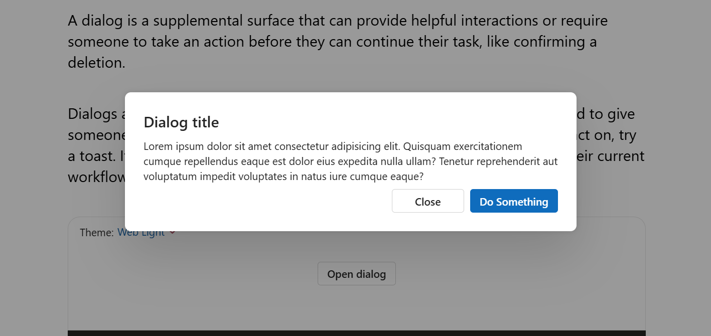
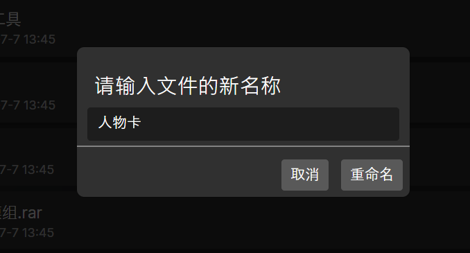
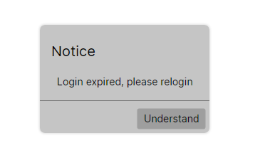

# Avalonia UI实现提示弹窗、输入弹窗


## 前言

在设计UI时经常会用到Dialog来提醒用户或者获取输入



这种Dialog一般都是打断性的（interruption），本文给出了使用Avalonia UI实现的可行方案

以下方案为了方便调用均为UserControl

## 带有输入框的弹窗
先来看看效果：


> 这个效果比较粗糙，因为只是实现了大体的功能。如果想要更好的效果可以对Margin，FontSize，配色等方面进行微调以符合Fluent2的设计语言
{: .prompt-info }

### 1. 新建UserControl

新建一个UserControl，命名为DialogOverlay

### 2. 实现覆盖父窗口并黑化背景

这样做有以下的目的：

1. 凸显主次关系
2. 阻止用户访问背景后的内容
   
> 文中的DynamicResource是一种动态资源，你可以把它替换为任何颜色
> 
> 请将namespace更换为自己程序的namespace
{: .prompt-info }

DialogOverlay.axml
```xml
<UserControl xmlns="https://github.com/avaloniaui"
             xmlns:x="http://schemas.microsoft.com/winfx/2006/xaml"
             xmlns:d="http://schemas.microsoft.com/expression/blend/2008"
             xmlns:mc="http://schemas.openxmlformats.org/markup-compatibility/2006"
             mc:Ignorable="d" d:DesignWidth="800" d:DesignHeight="450"
             x:Class="Netko.DialogOverlay">
  <Grid Background="{DynamicResource CatalogBaseLowColor}" HorizontalAlignment="Stretch" VerticalAlignment="Stretch">

	</Grid>
</UserControl>
```

### 3. 添加输入部分的控件

DialogOverlay.axml
```xml
<UserControl xmlns="https://github.com/avaloniaui"
             xmlns:x="http://schemas.microsoft.com/winfx/2006/xaml"
             xmlns:d="http://schemas.microsoft.com/expression/blend/2008"
             xmlns:mc="http://schemas.openxmlformats.org/markup-compatibility/2006"
             mc:Ignorable="d" d:DesignWidth="800" d:DesignHeight="450"
             x:Class="Netko.DialogOverlay">
	<Grid Background="{DynamicResource CatalogBaseLowColor}" HorizontalAlignment="Stretch" VerticalAlignment="Stretch">
		<Grid HorizontalAlignment="Center" VerticalAlignment="Center">
			<Border Background="{DynamicResource CatalogChromeMediumColor}" x:Name="BorderBackground" CornerRadius="7" Padding="0" Margin="0" Opacity="1" BoxShadow="0 0 3 1 #20000000"/>
			<StackPanel>
				<Label Margin="7" x:Name="Message">Explain</Label>
				<TextBox Margin="10 0" Width="200" BorderThickness="0" x:Name="Input"/>
				<Separator Margin="0 5" Padding="0"></Separator>

				<Button HorizontalAlignment="Right" Margin="5" Click="Send">Proceed</Button>
			</StackPanel>

		</Grid>

	</Grid>
</UserControl>

```


### 4. 增加逻辑代码

这里使用了Task来实现异步，这样可以直接返回用户输入的值

DialogOverlay.cs

```csharp
using Avalonia;
using Avalonia.Controls;
using Avalonia.Markup.Xaml;
using System.Threading.Tasks;

namespace Netko;

public partial class DialogOverlay : UserControl
{
    private TaskCompletionSource<string> _taskCompletionSource; // 用来存储结果和Task实例
    public DialogOverlay()
    {
        InitializeComponent();
    }
    public Task<string> ShowDialog(string message)
    {
        Message.Content = message;
        _taskCompletionSource = new TaskCompletionSource<string>(); // 创建异步操作，等待操作结束
        this.IsVisible = true;
        return _taskCompletionSource.Task; // 将Task实例返回
    }

    private void Send(object? sender, Avalonia.Interactivity.RoutedEventArgs e)
    {
        _taskCompletionSource?.SetResult(Input.Text);   // 设定了结果代表操作结束
        this.IsVisible = false;
    }
}
```

### 5. 使用

创建DialogOverlay，设置内容并显示，使用异步的方法获取返回值

```csharp
DialogOverlay inputName = new DialogOverlay();
OverlayReservedGrid.Children.Add(inputName);    // 把Overlay放到想要的地方
string? filename = await inputName.ShowDialog("请输入文件的新名称", "重命名", place_holder:SelfDir.Name); // 获取输入值
```

## 仅仅是提示框


与上面的大同小异

由于这里没有返回值，只做提示用，所以不需要用到异步操作
### 代码


MessageOverlay.axaml
```xml
<UserControl xmlns="https://github.com/avaloniaui"
             xmlns:x="http://schemas.microsoft.com/winfx/2006/xaml"
             xmlns:d="http://schemas.microsoft.com/expression/blend/2008"
             xmlns:mc="http://schemas.openxmlformats.org/markup-compatibility/2006"
             mc:Ignorable="d" d:DesignWidth="800" d:DesignHeight="450"
             x:Class="Netko.MessageOverlay">
	<Grid Background="{DynamicResource CatalogBaseLowColor}" HorizontalAlignment="Stretch" VerticalAlignment="Stretch">
		<Grid HorizontalAlignment="Center" VerticalAlignment="Center">
			<Border Background="{DynamicResource CatalogChromeMediumColor}" x:Name="BorderBackground" CornerRadius="7" Padding="0" Margin="0" Opacity="1" BoxShadow="0 0 3 1 #20000000"/>
			<StackPanel>
				<Label Margin="7">Notice</Label>
				<Label Margin="10">Login expired, please relogin</Label>
				<Separator Margin="0 5" Padding="0"></Separator>

				<Button HorizontalAlignment="Right" Margin="5" Click="Close">Understand</Button>
			</StackPanel>

		</Grid>
		
	</Grid>
</UserControl>

```

MessageOverlay.cs
```csharp
using Avalonia;
using Avalonia.Controls;
using Avalonia.Input;
using Avalonia.Markup.Xaml;

namespace Netko;

public partial class MessageOverlay : UserControl
{
    public MessageOverlay()
    {
        InitializeComponent();
    }
    private void Close(object? sender, Avalonia.Interactivity.RoutedEventArgs e)
    {

        this.IsVisible = false;

    }
}
```
### 用法

```csharp
MessageOverlay message = new MessageOverlay();
OverlayReservedGrid.Children.Add(message);
message.SetMessage("创建失败", $"创建{ParentPath + "/" + filename}时遇到错误");
```
