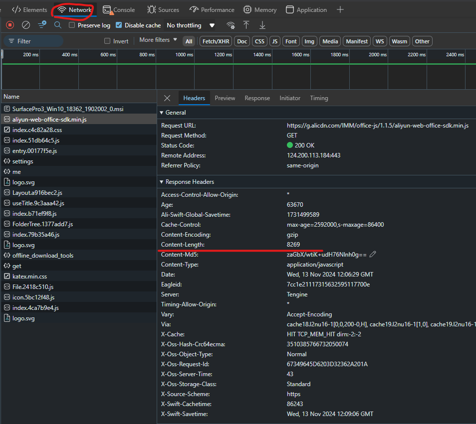
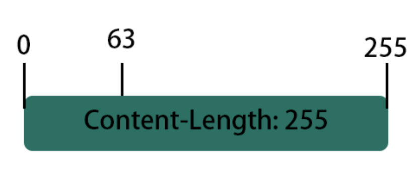

# C#多线程下载文件

## 前言

> 这段就算是简单多线程的实战了
> 
> 如果需要多线程入门，点[这里](/posts/csharp-multi-thread/)

日常中经常会遇到各种下载慢的情况，很多软件可以解决这个问题，如IDM、FDM、aria2c，甚至是某MC启动器PCL

本质上他们都是多线程下载，其主要思想是将文件**切片**

假设我们有大小为255byte的文件，一个人下就是从0下载直到255结束

这个时候，如果将文件分为多片，建立多个线程同时下载，就相当于有多个人在帮你下载同一个文件了，也就实现了加速（BT种子也是这样，也许以后数学好了我也会发一篇这个的笔记）


## 代码及用例
这里先贴代码：

从以下URL下载文件：
```
http://192.168.10.199/p/Local%20500G%20%E5%91%9C%E5%91%9C/SurfacePro3_Win10_18362_1902002_0.msi?sign=hwUl4yfX8aRrmAb-U0oqcyELDWUY_XxPzlFHXQuVjUk=:0
```
使用了浏览器的UA：
```
Mozilla/5.0 (Windows NT 10.0; Win64; x64) AppleWebKit/537.36 (KHTML, like Gecko) Chrome/130.0.0.0 Safari/537.36 Edg/130.0.0.0
```
保存到`a.msi`

```csharp
using System;
using System.IO;
using System.Net.Http;
using System.Threading.Tasks;
using System.Threading;

public class Range
{
    public long from { get; set; }
    public long to { get; set; }
}

public class Downloader
{
    private readonly object _lock = new object();
    private FileStream FileStream {  get; set; }
    private int TotalThread {  get; set; }
    private int CurrentThread { get; set; }
    private string Url { get; set; }
    private string UserAgent { get; set; }

    private long downloadSize = 0;
    private int downloadProgress = 0;
    private long downloaded = 0;
    private long totalSize = 0;
    public Downloader(string url, string user_agent, string file_path, int thread)
    {
        TotalThread = thread;
        CurrentThread = 0;
        Url = url;
        UserAgent = user_agent;
        FileStream = new FileStream(file_path, FileMode.OpenOrCreate, FileAccess.ReadWrite);
    }
    public async Task<long> GetInfo()
    {
        using (HttpClient client = new HttpClient()){
            client.DefaultRequestHeaders.Add("User-Agent", UserAgent);
            using (HttpResponseMessage response = await client.GetAsync(Url))
            {
                response.EnsureSuccessStatusCode();

                totalSize = response.Content.Headers.ContentLength ?? 0;
                FileStream.SetLength(totalSize);
                Console.WriteLine(totalSize.ToString());
                return totalSize;
            }
        }
        return 0;
    }
    public List<Range> CalcRange()
    {
        var range = new List<Range>();
        long start = 0;
        if (totalSize > 0)
        {
            long average_size = totalSize / TotalThread;
            for (int i = 0; i < TotalThread; i++)
            {
                if (i == TotalThread - 1)
                {
                    range.Add(new Range
                    {
                        from = start,
                        to = totalSize
                    });
                }
                else
                {
                    range.Add(new Range
                    {
                        from = start,
                        to = start + average_size
                    });
                    start += average_size;
                }
            }
        }
        return range;
    }
    public async Task DownloadThread(Range range)
    {

        long pointer = range.from;
        using (HttpClient client = new HttpClient())
        {
            client.DefaultRequestHeaders.Add("Range", $"bytes={range.from}-{range.to}");
            client.DefaultRequestHeaders.Add("User-Agent", UserAgent);
            using (HttpResponseMessage response = await client.GetAsync(Url))
            {
                response.EnsureSuccessStatusCode();

                long? totalSize = response.Content.Headers.ContentLength;
                using (Stream contentStream = await response.Content.ReadAsStreamAsync())
                {
                    byte[] buffer = new byte[8192];
                    int bytesRead;
                    while ((bytesRead = await contentStream.ReadAsync(buffer, 0, buffer.Length)) > 0)
                    {
                        //await write 
                        downloaded += bytesRead;
                        lock (_lock)
                        {
                            Console.WriteLine("WriteTo: " + pointer.ToString() + " By: " + range.from.ToString());

                            FileStream.Seek(pointer, SeekOrigin.Begin);
                            FileStream.Write(buffer, 0, bytesRead);
                        }
                        pointer += bytesRead;
                        
                    }
                }
            }
        }
    }
    public void releaseFile()
    {
        Console.WriteLine("File has been relese");
        lock (_lock)
        {
            FileStream.Close();
        }
    }
    public async void Run()
    {
        long size = await GetInfo();
        Console.WriteLine("Getinfo complete, size: " + totalSize.ToString());
        //CountdownEvent countDown = new CountdownEvent(TotalThread);
        List<Task> tasks = new List<Task>();
        foreach (Range range in CalcRange())
        {
            Console.WriteLine("Thread start: " + range.from.ToString());
            tasks.Add(DownloadThread(range));
        }
        await Task.WhenAll(tasks);
        //countDown.Wait();
        releaseFile();
    }
}

class Program
{
    static void Main(string[] args)
    {
        Downloader download = new Downloader("http://192.168.10.199/p/Local%20500G%20%E5%91%9C%E5%91%9C/SurfacePro3_Win10_18362_1902002_0.msi?sign=hwUl4yfX8aRrmAb-U0oqcyELDWUY_XxPzlFHXQuVjUk=:0", "Mozilla/5.0 (Windows NT 10.0; Win64; x64) AppleWebKit/537.36 (KHTML, like Gecko) Chrome/130.0.0.0 Safari/537.36 Edg/130.0.0.0", "a.msi", 32);
        download.Run();
        Console.ReadLine();
    }
}
```
## 明确需求

刚刚说到多线程下载文件的核心是切片，那么就引申出了几个问题：

- 如何提前预知文件的大小
- 如何计算每个分片的大小并让服务器返回对应分片
- 如何将这些分片整合


## 预知大小

在HTTP传输中，正文会包含一个拥有许多信息的`头（Header）`，头里面一般会有一个叫`Content-Length`的值，这就是body的大小，也就是我们文件的大小

打开你的浏览器，按下`F12`打开开发者工具，选择网络，刷新一下网页，就可以看到`Response Headers`中包含有`Content-Length`



这个数值就是这个页面的大小

可以使用以下代码获取：
```csharp
long totalSize;
using (HttpClient client = new HttpClient()){
    using (HttpResponseMessage response = await client.GetAsync(Url))
    {
        response.EnsureSuccessStatusCode();
        totalSize = response.Content.Headers.ContentLength ?? 0;
        FileStream.SetLength(totalSize);
        Console.WriteLine("文件大小为: " + totalSize.ToString());
        return totalSize;
    }
}
return 0;
```
> 由于文件一般很大，文件大小最好用`long`存储
>
> 如果无法获取，有可能是这个页面不支持`Content-Length`或是未经授权，可以尝试`client.DefaultRequestHeaders.Add`语句添加`User-Agent`和`Host`
{: .prompt-info }

## 计算切片大小

这里我们简化以下，假设有255长度的文件，为了方便表示我们把他切成不等的两片：



可以看到第一段的范围为`0-63`

第二段范围为`64-255`

将这两段合并即为整个文件

这里的规则是：第一段以`0`为起点，`n`为终点，后一段以`n+1`为起点`m`为终点，以此类推，直到终点为文件总长度

---

既然要使用多线程，那么就要定义线程数，每个线程下载对应的部分，这里使用均分的方法：


```csharp

public class Range
{
    public long from { get; set; }
    public long to { get; set; }
}

private long totalSize = 0;           // 在这里定义文件大小
private int TotalThread {  get; set; }// 在这里定义线程数

public List<Range> CalcRange()
{
  var range = new List<Range>();
  long start = 0;
  if (totalSize > 0)
  {
      long average_size = totalSize / TotalThread;
      for (int i = 0; i < TotalThread; i++)
      {
          if (i == TotalThread - 1) // 最后一段要把剩余所有没下的都要下上
          {
              range.Add(new Range
              {
                  from = start,
                  to = totalSize
              });
          }
          else                    // 之前的直接均分
          {
              range.Add(new Range
              {
                  from = start,
                  to = start + average_size
              });
              start += average_size;
          }
      }
  }
  return range;
}
```

## 让服务器返回对应的文件块

和`Response Headers`中含有文件大小的`Content-Length`一样，你也可以在`Request Headers`中定义想要文件的哪一部分

具体操作为，在`Request Headers`中定义：
```
Range: bytes=0-63
```
使用C#：
```csharp
Range range = new Range{from=0, to=63};
using (HttpClient client = new HttpClient())
{
  client.DefaultRequestHeaders.Add("Range", $"bytes={range.from}-{range.to}");
  using (HttpResponseMessage response = await client.GetAsync(Url))
  {
      response.EnsureSuccessStatusCode();
      ...
  }
}
```

这里我们使用**流式传输 (Stream)**的方式下载文件块

如果不使用流式传输，那么整个请求会进入*假死*状态，直到下载完毕整个文件块再执行后面的代码

而使用了流式传输，我们就可以接收一点文件（如8192字节的文件）后去完成些别的任务（如计算下载进度、下载速率等），之后重复这一步骤直到文件块接收完毕

代码如下：
```csharp


public async Task DownloadThread()
{
  Range range = new Range{from=0, to=63}; // 使用之前写的Range
  string UserAgent = "....."  //这里为了通过验证填入UA
  long pointer = range.from;              
  using (HttpClient client = new HttpClient())
  {
      client.DefaultRequestHeaders.Add("Range", $"bytes={range.from}-{range.to}");//在Request Headers中定义下载范围
      client.DefaultRequestHeaders.Add("User-Agent", UserAgent);          //设置UA
      using (HttpResponseMessage response = await client.GetAsync(Url))
      {
          response.EnsureSuccessStatusCode(); //确保状态码无误
          long? totalSize = response.Content.Headers.ContentLength;             //获取这部分文件块的大小
          using (Stream contentStream = await response.Content.ReadAsStreamAsync())   //使用流式传输
          {
              byte[] buffer = new byte[8192];   // 新建buffer，用来存储流式传输每次下载的部分文件
              int bytesRead;
              while ((bytesRead = await contentStream.ReadAsync(buffer, 0, buffer.Length)) > 0) //获取最多8192字节的内容，获取到的内容长度存入bytesRead
              {
                  downloaded += bytesRead;    //已经下载完毕的大小，用来计算下载进度
                  lock (_lock)      //使用线程锁，之后会提到
                  {
                      Console.WriteLine("WriteTo: " + pointer.ToString() + " By: " + range.from.ToString());
                      FileStream.Seek(pointer, SeekOrigin.Begin);   // 将文件指针移动到需要写入数据的地方
                      FileStream.Write(buffer, 0, bytesRead);       // 将获取到的那点数据写入
                  }
                  pointer += bytesRead;
                  
              }
          }
      }
  }
}
```

## 多线程管理

由于这是个典型的**I/O密集型操作**，我们使用并发的方式进行处理

这里的想法是：
1. 向服务器获取文件大小
2. 创建一个文件实例，让所有线程都使用这一文件实例进行文件写入操作
3. 计算每个线程下载的文件块大小
4. 建立多个线程同时下载文件，使用线程池自动管理
5. 等待所有文件块下载完毕，此时所有下载线程关闭，释放文件块

这里使用`Task`来对线程池进行自动管理

代码如下：
```csharp
public async void Run()
{
    long size = await GetInfo();      // 获取文件大小，获取完毕进入下一步
    Console.WriteLine("Getinfo complete, size: " + totalSize.ToString());

    // 你也可以使用倒计时器countDown对线程是否全部关闭做出判断，但是Task更加简单好用
    //CountdownEvent countDown = new CountdownEvent(TotalThread);   

    List<Task> tasks = new List<Task>();      // 这个列表用来存储、等待 所有的下载线程
    foreach (Range range in CalcRange())      // 计算下载大小并拉起线程进行下载
    {
        Console.WriteLine("Thread start: " + range.from.ToString());
        tasks.Add(DownloadThread(range));     // 将线程加入列表
    }
    await Task.WhenAll(tasks);                // 等待所有线程下载完毕后退出
    //countDown.Wait();
    releaseFile();                            // 释放文件资源
}
```

## 改进

这里只是一个简单的示例，你还可以改进这段代码，增加速度、进度的计算，下载时的程序回调

使用**线程阻塞**实现暂停，**取消线程**实现取消下载文件等等

# 改进过的多线程下载

下文是实战中编写的，拥有*暂停、取消*的多线程下载

针对一些特殊的下载场景（服务器限制每次分片下载大小、连接线程数、限速等）做了优化

## 问题和特殊要求

1. 服务器限制了连接数，每个连接的下载大小
2. 需要向UI线程回调
3. 需要兼容其他的下载器
4. 服务器会返回多个相同文件的下载地址，可以使用多个线程分别下载多个地址的文件


## 使用Interface兼容其他的下载器

> 如果您熟悉`Interface`的使用，请不要在此处浪费时间

一个软件可能会有多个下载器，比如需要同时兼容单线程下载、多线程下载、外部下载器(aria2c, motrix)的调用

可以预见的是，这些下载方式具有的功能是高度重复的，都可以简化为以下功能：

- 添加下载任务
- 暂停任务
- 继续任务
- 删除任务
- 获取下载进度

对此，我们可以使用`Interface`来简化我们的代码：

声明一个Interface, 内含所有下载方式都共有的函数
> 在声明接口时，最好使用`I + 类名`来声明接口名

```csharp
public class Range
{
    public long from { get; set; }
    public long to { get; set; }
}
public class DownloadStatus
{
    public float downloadProgress;
    public long downloaded;
    public long totalSize;
    public int linkCount;
    public int downloadingThread;
    public long downloadBlockSize;

    public bool isPaused;
    public bool isDownloading;
    public bool isComplete;
}
public interface IDownload
{
    void SetCallBack(Action callBack);    // UI线程的程序回调
    void AddUrl(string url);              // 有多个Url的话可以继续添加
    DownloadStatus Status();              // 用于获取下载进度等
    void Pause();                         // 暂停
    void Continue();                      // 继续
    void Cancel();                        //取消
    Task DownloadThread(Range range, string url);   // 下载函数
    void releaseFile();                   // 释放被占用的文件
    void Run();                           // 开始下载
}
```

之后创建一个类去使用这个接口：

这里先贴代码，解释在后面

```csharp
public class Downloader: IDownload        // 声明使用IDownload接口
{
    // 锁，用于保证不同线程无法同时访问IO资源
    private readonly object _lock = new object();
    // 阻塞，用于暂停/继续下载，默认继续下载
    private readonly ManualResetEvent resetEvent = new ManualResetEvent(true);
    // 取消信号，判断用户是否取消任务
    private CancellationTokenSource cts = new CancellationTokenSource();
    private FileStream FileStream { get; set; }
    private int TotalThread { get; set; }
    private int CurrentThread { get; set; }
    private string Url { get; set; }
    private string UserAgent { get; set; }
    private string filePath { get; set; }

    public Action? CallBack { get; set; }

    private Dictionary<int, string> linkList = new Dictionary<int, string>();

    public float downloadProgress = 0;
    public long downloaded = 0;
    public long totalSize = 0;
    public int linkCount = 0;
    public int downloadingThread = 0;
    public long downloadBlockSize = 500087;

    public bool isPaused = false;
    public bool isDownloading = true;
    public bool isComplete = false;


    public Downloader(string url, string user_agent, string file_path, long total_size, int thread)
    {
        TotalThread = thread;
        CurrentThread = 0;
        Url = url;
        linkList.Add(linkCount, url);
        linkCount++;

        UserAgent = user_agent;
        totalSize = total_size;
        filePath = file_path;

        FileStream = new FileStream(file_path, FileMode.OpenOrCreate, FileAccess.ReadWrite);
        FileStream.SetLength(total_size);
    }
    public void AddUrl(string url)
    {
        linkList.Add(linkCount, url);
        linkCount++;

    }
    public void SetCallBack(Action callBack)
    {
        CallBack = callBack;
    }
    private void CalcProgress()
    {
        if (downloaded > 0)
        {
            downloadProgress = (float)downloaded / totalSize;
        }
        if (downloadingThread == 0)
        {
            isDownloading = false;
        }
        else
        {
            isDownloading = true;
        }
        if (downloaded == totalSize)
        {
            isDownloading = false;
            isComplete = true;
        }
        
        Console.WriteLine(downloadProgress.ToString() + "\r");
    }

    // 因为服务器限制每次下载的大小，所以这里做了修改
    // 每个线程只下载 downloadBlockSize 大小的文件后就退出
    private List<Range> CalcRange()
    {
        List<Range> ranges = new List<Range>();
        long calced_size = 0;
        while (true)
        {
            if (calced_size + downloadBlockSize > totalSize)
            {
                ranges.Add(new Range
                {
                    from = calced_size,
                    to = totalSize
                });
                break;

            }
            else
            {
                ranges.Add(new Range
                {
                    from = calced_size,
                    to = calced_size + downloadBlockSize,
                });
            }
            calced_size += downloadBlockSize + 1;

        }
        return ranges;
    }
    /// <summary>
    /// block thread to pause
    /// </summary>
    public void Pause()
    {
        resetEvent.Reset();
        isPaused = true;
        CalcProgress();
        CallBack?.Invoke();

    }

    /// <summary>
    /// release resetEvent to cntinue
    /// </summary>
    public void Continue()
    {
        resetEvent.Set();
        isPaused = false;
        CalcProgress();
        CallBack?.Invoke();

    }
    public void Cancel()
    {
        resetEvent.Set();
        isPaused = false;
        cts.Cancel();
        isComplete = true;
        CalcProgress();
        CallBack?.Invoke();

    }
    public DownloadStatus Status()
    {
        return new DownloadStatus
        {
            downloadProgress = downloadProgress,
            downloaded = downloaded,
            totalSize = totalSize,
            linkCount = linkCount,
            downloadingThread = downloadingThread,
            downloadBlockSize = downloadBlockSize,

            isPaused = isPaused,
            isDownloading = isDownloading,
            isComplete = isComplete,
        };
    }
    public async Task DownloadThread(Range range, string url)
    {

        long pointer = range.from;
        try
        {
            using (HttpClient client = new HttpClient())
            {
                client.DefaultRequestHeaders.Add("Range", $"bytes={range.from}-{range.to}");
                client.DefaultRequestHeaders.TryAddWithoutValidation("User-Agent", UserAgent);

                client.Timeout = TimeSpan.FromSeconds(10);
                using (HttpResponseMessage response = await client.GetAsync(url))
                {
                    response.EnsureSuccessStatusCode();
                    resetEvent.WaitOne();
                    if (cts.IsCancellationRequested)
                    {
                        releaseFile();
                        // exit thread
                        return;
                    }
                    long? totalSize = response.Content.Headers.ContentLength;
                    using (Stream contentStream = await response.Content.ReadAsStreamAsync())
                    {
                        byte[] buffer = new byte[1000];
                        int bytesRead;
                        while ((bytesRead = await contentStream.ReadAsync(buffer, 0, buffer.Length)) > 0)
                        {
                            resetEvent.WaitOne();
                            if (cts.IsCancellationRequested)
                            {
                                releaseFile();
                                // exit thread
                                return;
                            }
                            //await write 
                            downloaded += bytesRead;
                            lock (_lock)
                            {
                                Console.WriteLine("WriteTo: " + pointer.ToString() + " By: " + range.from.ToString());
                                CalcProgress();
                                Dispatcher.UIThread.InvokeAsync(() =>
                                {
                                    CallBack?.Invoke(); // 在 UI 线程中调用
                                });
                                FileStream.Seek(pointer, SeekOrigin.Begin);
                                FileStream.Write(buffer, 0, bytesRead);
                            }
                            pointer += bytesRead;

                        }
                    }
                }
            }
        }
        catch (Exception ex)
        {
            await DownloadThread(range, url);
        }

    }
    private bool isFileReleased() {
        try
        {
            return FileStream.SafeFileHandle.IsClosed;
        }
        catch (ObjectDisposedException)
        {
            return true;
        }
    }
    public void releaseFile()
    {
        lock (_lock)
        {
            if (!isFileReleased())
            {
                FileStream.Close();

            }
        }
        if (cts.IsCancellationRequested)
        {
            if (File.Exists(filePath))
            {
                File.Delete(filePath);
            }
        }
        isDownloading = false;
    }
    public async void Run()
    {
        List<Range> rangeLsit = CalcRange();
        SemaphoreSlim semaphore = new SemaphoreSlim(TotalThread);
        Console.WriteLine(rangeLsit.Count.ToString());
        Task[] tasks = new Task[rangeLsit.Count];
        for (int i = 0; i < rangeLsit.Count; i++)
        {
            if (cts.IsCancellationRequested)
            {
                break;
            }
            await semaphore.WaitAsync();
            int threadId = i;
            int arrangeLinkId = threadId % linkList.Count;
            tasks[threadId] = Task.Run(async () =>
            {
                try
                {
                    downloadingThread++;
                    await DownloadThread(rangeLsit[threadId], linkList[arrangeLinkId]);
                    downloadingThread--;
                }
                finally
                {
                    semaphore.Release();
                }
            });
        }
        if (!tasks.Contains(null))
        {
            await Task.WhenAll(tasks);

        }
        releaseFile();
        CalcProgress();
        CallBack?.Invoke(); 

    }

}
```

## 暂停/继续的实现

这里使用线程阻塞`ManualResetEvent`来实现，用法和`线程锁`很像，你可以在[这里](/posts/csharp-multi-thread/#线程锁和线程阻塞的区别)找到他们的区别

声明一个`ManualResetEvent`
```csharp
private readonly ManualResetEvent resetEvent = new ManualResetEvent(true);
```

我们此时传入了`true`，所以默认不阻塞

通过下面的函数可以切换是否阻塞：
```csharp
resetEvent.Reset();   // 阻塞线程
resetEvent.Set();     // 取消阻塞
```

下面的函数可以在阻塞时暂停线程的运行，取消阻塞时放行：

```csharp
resetEvent.WaitOne();
```

所以我在流式传输的等待服务器相应和下载部分添加了WaitOne方法：

```csharp
Some Code...
using (HttpClient client = new HttpClient())
{
    client.DefaultRequestHeaders.Add("Range", $"bytes={range.from}-{range.to}");
    client.DefaultRequestHeaders.TryAddWithoutValidation("User-Agent", UserAgent);

    client.Timeout = TimeSpan.FromSeconds(10);
    using (HttpResponseMessage response = await client.GetAsync(url))
    {
        response.EnsureSuccessStatusCode();
        resetEvent.WaitOne();           // 如果线程被阻塞，线程会在这里暂停运行
        long? totalSize = response.Content.Headers.ContentLength;
        using (Stream contentStream = await response.Content.ReadAsStreamAsync())
        {
            byte[] buffer = new byte[1000];
            int bytesRead;
            while ((bytesRead = await contentStream.ReadAsync(buffer, 0, buffer.Length)) > 0)
            {
                resetEvent.WaitOne();   // 如果线程被阻塞，线程会在这里暂停运行
Some Code...
```

并编写`Pause` `Continue`方法来控制是否阻塞：
```csharp
/// <summary>
/// block thread to pause
/// </summary>
public void Pause()
{
    resetEvent.Reset();   // 阻塞线程来达到暂停效果
    isPaused = true;
    CalcProgress();
    CallBack?.Invoke();

}

/// <summary>
/// release resetEvent to cntinue
/// </summary>
public void Continue()
{
    resetEvent.Set();   // 取消阻塞继续工作
    isPaused = false;
    CalcProgress();
    CallBack?.Invoke();

}
```

## 取消下载的实现

C#中存在取消信号`CancellationTokenSource`可以用于此处

> 这部分应该会在多线程进阶里，但是我太懒了没去写 + 在准备CET4，So SOON[TM]

声明取消信号
```csharp
private CancellationTokenSource cts = new CancellationTokenSource();
```

他拥有一个布尔类型`IsCancellationRequested`可用于检测是否触发取消：

```csharp
cts.IsCancellationRequested
```

所以我们在连接服务器和下载时检测是否取消即可：

```csharp
if (cts.IsCancellationRequested)
{
    releaseFile();    // 别忘了释放被占用的文件
    // 直接return退出线程即可
    return;           
}
```

## UI回调的实现

这里实现的方式各有千秋，我的实现方式是再写入文件后通过一个CallBack函数实现实时的数据回调

```csharp
public Action? CallBack { get; set; }
```

使用此方法设置回调函数：
```csharp
public void SetCallBack(Action callBack)
{
    CallBack = callBack;
}
```

使用调度器`Dispatcher`可以将我们的代码调度到UI线程执行：

> 是的，又是一个应该在多线程进阶里出现的东西，挖的坑以后再填

于是在写入文件的代码之后加上：

```csharp
Dispatcher.UIThread.InvokeAsync(() =>
{
    CallBack?.Invoke(); // 在 UI 线程中调用
});
```

现在每次下载完文件块就会调用CallBack函数了，在CallBack函数中添加状态显示的逻辑代码即可

## 优化

这部分代码仍有以下问题
### 由于网络环境很差，文件释放不及时

这部分原因其实不是代码导致的，而是很多下载服务器会**限速**

限速的原理的简化版本是：

下载的第一秒传输数据，后9秒不传输数据，如此循环

经过速度算法的掩盖（可以使`显示的下载速度`更加平滑，明明已经是`0B/s`但是显示`100KB/s`）普通人很难察觉到

一个很简单的检验方法：打开任务管理器，看看网卡占用的图表，如果看着像一座一座山，就是被限速了

解决方法：

- 添加更多的取消信号监测点
- 取消任务后直接释放文件，并在写入文件前添加`FileStream`是否可用的检测

### 如果网络出错，下载会疯狂重试进入死循环

解决方法：
- 添加最大重试数

## 结尾

我好累...
