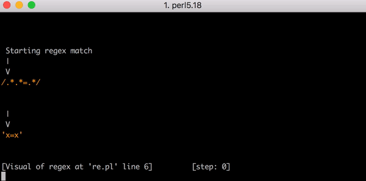
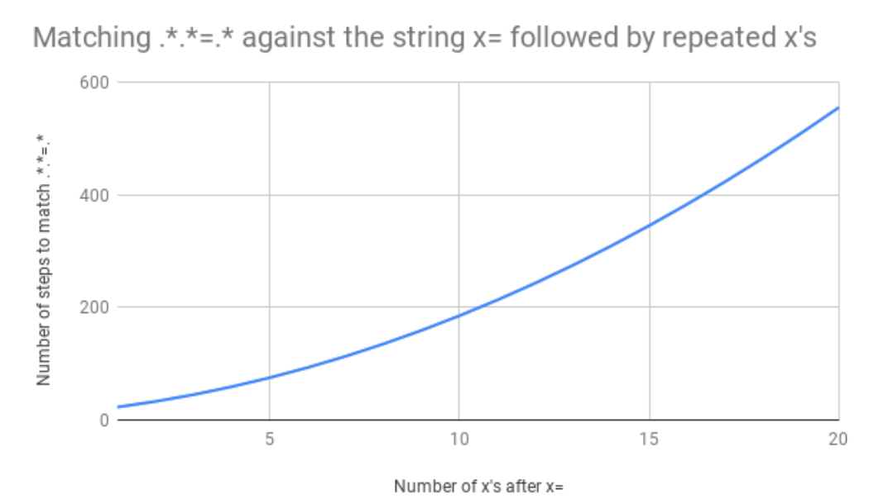

# 正则表达式灾难性回溯

## 前言

2019 年 7 月 2 日，全球大部分网站出现了无法访问、502错误的问题

这一切的问题的来源是一位工程师添加了一项XSS检测规则

这位工程师是如何凭借一行代码拉倒Cloudflare在全球的 Web 服务的？

> 你可以在[这里](https://blog.cloudflare.com/details-of-the-cloudflare-outage-on-july-2-2019/)找到这份事故的详细调查报告

## 事故的过程

一位工程师向 WAF 修改提交了一条规则

在检测规则的更改提交的三分钟后，第一个警告出现，随后是广泛的502错误，全球城市的接入点相继报错，指出CPU耗尽

随后Cloudflare失去了全球 80% 的流量

事故发生的20分钟后，工程团队从调取的实时 CPU 占用认定 WAF 是导致问题的组件

于是他们决定在全球范围内禁用 WAF 组件，直到半小时后，全球流量水平和 CPU 只占用才恢复到预期水平

事故发生的一个小时十分钟后，工程团队对问题进行了修复，重新启用了 WAF ，问题解决

## 灾难性回溯

在正则表达式中，如果匹配失败，正则引擎会尝试**回溯**来测试所有可能的匹配

如果正则表达式结构过于复杂且匹配失败的路径非常多，这种回溯会导致指数级的性能问题，使匹配时间急剧增加，甚至导致系统资源的耗尽

这里有一个便于理解的正则表达式：


```
(a|aa)*b
```
这个正则表达式会匹配用**a或aa**去匹配任意数量的a，后面跟着一个b的字符串

如果用它去匹配下面的一个字符串会怎么样呢？
```
aaab
```
他会使用贪婪匹配进行**排列组合**

尝试使用一个a或两个a的方式去匹配前面的这n个a，直到找到一个正确匹配

1. 匹配到aa，因为aa优先于a
2. 匹配到a，此时字符串剩余b
3. 有b，没问题

那如果是这样的呢？
```
aaaaaaaaa
```

1. 匹配aa，剩余aaaaaaa
2. 匹配aa，剩余aaaaa
3. 匹配aa，剩余aaa
4. 匹配aa，剩余a
5. 匹配a，剩余空字符串
6. 匹配b，欸？没了，那么触发回溯
7. 退回第4步的匹配aa，改成匹配a，还是没有b，继续回溯
8. 退回第3步，改为匹配a，还是没有b，继续回溯
9. 如此反复，尝试所有可能的组合...

也就是说，使用这个正则表达式`(a|aa)*b`去匹配长度为n的字符串，贪婪匹配的组合数是指数级的

回溯次数约为 `2^(n-1)`，这就导致了计算资源的耗尽


## 发生了什么

让我们回到那条被修改的规则，这是一条正则表达式，他看起来是这样的

```
(?:(?:\"|'|\]|\}|\\|\d|(?:nan|infinity|true|false|null|undefined|symbol|math)|\`|\-|\+)+[)]*;?((?:\s|-|~|!|{}|\|\||\+)*.*(?:.*=.*)))
```

这段表达式可以被简化为以下部分：
```
.*.*=.*
```

让我们来拆以下，更方便理解：
- `.*.*`表示两个任意长度的匹配
- `=`匹配的这个字符串中间要夹着个`=`
- `.*` 是匹配任意数量的任意字符

其中`.*.*`会引入**重叠匹配**的问题，即第一个`.*`匹配从头开始的任意字符，但后面的 `.*` 也可以尝试匹配零字符或部分字符

导致引擎需要不断回溯来尝试所有可能的分割方案

还是拿很多a举例子，假如需要匹配下面这段字符串：
```
aaaaaaaaaaaaaaaaaa
```
引擎会：
1. 第一个`.*`匹配`aaaaaaaaaaaaaaaaaa`，剩下空字符串，第二个`.*`匹配了空的字符串，剩下了空字符串
2. 匹配`=`，发现没有，回溯
3. 第一个`.*`匹配`aaaaaaaaaaaaaaaaa`（少匹配了个a），剩下`a`，第二个`.*`匹配了`a`，剩下了空字符串
4. 匹配`=`，发现没有，回溯
5. 第一个`.*`匹配`aaaaaaaaaaaaaaaa`（少匹配了2个a），剩下`aa`，第二个`.*`匹配了`aa`，剩下了空字符串
6. 匹配`=`，发现没有，回溯....

这个过程会继续，直到尝试完所有可能的分割点

对于长度为20的字符串，需要尝试约 `2^19` 次，也就是**524,288** 次

[这里](https://metacpan.org/pod/Regexp::Debugger)有一个可视化工具可以展示回溯




## 解决方法

### 优化正则表达式

少使用贪婪模式的重复匹配`.*`，改为非贪婪匹配`.*?`

### 提供更加明确的上下文

`.*.*=.*` 替换为 `[^=]*=.*` 就避免了多次回溯

### 增加长度限制

将`.*` 替换为 `.{0,100}`，就可以对匹配的字符串长度作出限制

### 使用更加现代的正则引擎

是的，有时候问题解决不了把问题埋起来就看不见了

许多现代的正则引擎（如`RE2`）都通过设计避免了灾难性回溯
