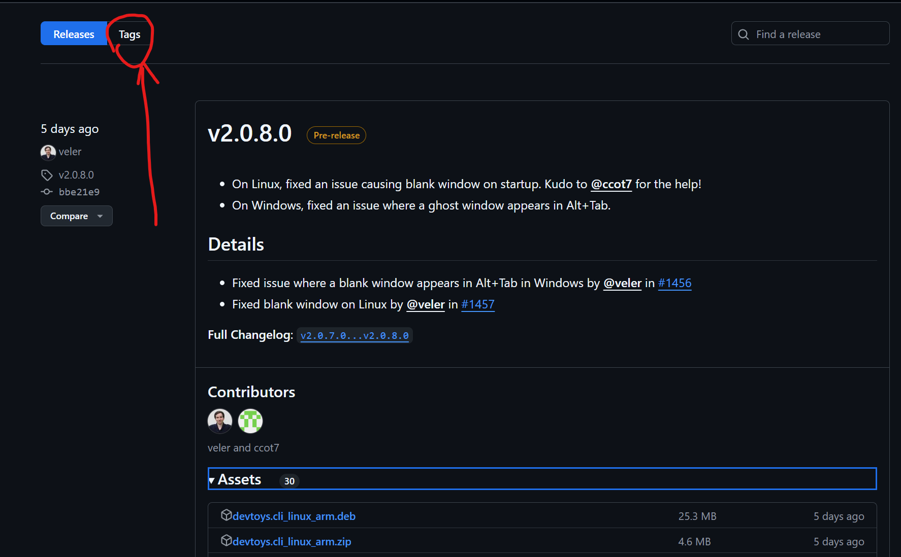

# Github Action入门

> 此笔记尚未完成
{: .prompt-info }

本文将学习使用Gihub Action创建Workflow进行自动构建+自动部署

仅仅是个入门，深挖请移步[官方文档](https://github.blog/enterprise-software/ci-cd/build-ci-cd-pipeline-github-actions-four-steps/)

## 这是什么？

在我们的工作流中经常会遇到需要适配不同平台(Windows, Linux, MacOS...)对软件进行构建后发布

如果自己手动去Build后发布，那么需要在不同的虚拟机间切换、拉取代码、构建、发布

极其繁琐

这时我们就需要一个能够**自动构建，自动部署**的工具

隆重介绍：**CI/CD 持续集成和持续部署工具**

**Github Action**就是一个可以在代码的不同生命周期(如push请求)自动执行任务的CI/CD工具

下面将以最简单的C#程序为例子 了解这个workflow的配置

## 创建Gtihub Actions 工作流

Github Actions靠你的repo中`.github/workflows`中的文件定义

### 创建一个最简单的C#项目

创建一个hello world项目，并配置git

```bash
dotnet new console -n MyTestApp
cd MyTestApp
git init
git remote add origin https://github.com/yourusername/your-repository.git
git add .
git commit -m "Initial commit"
git branch -M main
git push origin main
```

### 编写Workflow文件

在repo中创建`.github/workflows`目录
```bash
mkdir -p .github/workflows
```

创建workflow文件

```bash
touch .github/workflows/publish-release.yml
```

### Wrokflow中的过程

Github提供了许多环境(真的很多)帮助你构建你的程序

可以理解为一台纯净的，用完即还原的虚拟机
你可以在[这里](https://docs.github.com/zh/actions/using-github-hosted-runners/using-github-hosted-runners/about-github-hosted-runners#supported-runners-and-hardware-resources)找到这些支持的环境


所以我们的简单流程是：

1. 检测到`Push`请求时，开始构建
2. 首先获得一台用来构建的环境(Windows, Linux...)
3. 在这个环境里把你的代码拉取下来
4. 安装编译环境、运行时
5. 编译代码
6. 测试代码(可选)
7. 将编译的二进制文件打包发布


那么编写`publish-release.yml`中的内容：
```yaml
name: Build and Publish to GitHub Release

on:
  push:
    branches:
      - main  # 在推送到 `main` 分支时触发工作流

jobs:
  build:
    runs-on: ubuntu-latest  # 使用 Ubuntu 作为构建环境

    steps:
      - name: Checkout the repository
        uses: actions/checkout@v2  # 获取代码库，这是github社区提供的简便方法

      - name: Set up .NET
        uses: actions/setup-dotnet@v1
        with:
          dotnet-version: '8.0'  # 设置 .NET SDK 版本（根据你的来自行修改）

      - name: Restore dependencies
        run: dotnet restore  # 恢复依赖项

      - name: Build the application
        run: dotnet build --configuration Release  # 构建项目

      - name: Publish the application
        run: dotnet publish --configuration Release --output ./publish  # 打包发布

      - name: Create Release on GitHub
        uses: softprops/action-gh-release@v1  # 用于创建 GitHub Release
        #env:
        if: startsWith(github.ref, 'refs/tags/')    # 只有commit中带有tag才会发布
        with:
          token: ${{ secrets.GITHUB_TOKEN }}  # GitHub 自动提供的访问令牌
          files: ./publish/*  # 发布所有打包的文件 
```


## 其中一些内容的解释

### if: startsWith(github.ref, 'refs/tags/')

在下载别人发布的的软件时，你有没有发现这个？


这个`v1.0.13.0`，长得和版本号一样其实也就是版本号的东西叫做`Tag (标签)`

> 这种版本号其实叫[语义化版本](https://semver.org/lang/zh-CN/)

打开这些Github的Release页面，就可以看到这个`Tag`



他的作用是：

为某个 **特定的提交（commit）** 打标签，这些标签通常被用来标记项目的某个**重要里程碑（如版本发布）**。它为提交添加了一个易于记忆的别名，方便以后查找和引用


**Git**支持一种命令叫`tag`，一般有三种方法创建：

无说明的(轻量标签):
```bash
git tag v1.0
```

---

有说明的（带有附加信息）：
```bash
git tag -a v1.0 -m "Version 1.0 release"
```
其中`-m`为标签中附加版本说明，比如“Version 1.0 release”

---

为之前的提交打标签：
```bash
git tag v1.1 9fceb02
```
`9fceb02`为那次提交的hash

