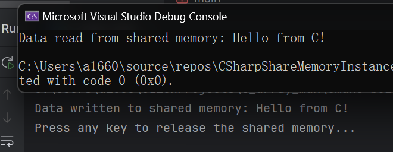
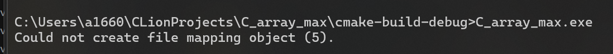

# C#和C在Windows环境下使用共享内存实现数据共享

如果不同进程的程序之间想要交换数据，很多人想到的是通过文件IO或是网络的方式交换，但是这种方法一般比较低效

一个解决方式是在两个进程之间使用共享内存，直接在内存中互相交换数据

本文将以Windows平台C语言写入内存，C#读取的方式举例

> 在不同的操作系统上，共享内存实现的方式可能不同
>
> Linux可以使用 `shmget`、`shmat`、`shmdt`、`shmctl` 系统调用
{: .prompt-info }

## 什么样的数据可以共享？

看看能共享什么：

### 简单的数据类型

- 整数: `int` `long` `unsigned int`等
- 浮点: `float` `double`
- 字符: `char`
- 布尔: `true` `false`

### 字符串

要求: 字符串的传输需要明确长度或以特殊符号结尾(如`\0`)

### 数组

有了字符串当然也有数组

要求: 不能是动态数组，需要明确长度

### 结构体

要求: 结构体必须是 **`POD (Plain Old Data)`** 类型( *无复杂成员，如指针、动态数组* )

数据的对齐方式需要一致

如：
```c
struct Data {
    int id;
    float value;
};

struct Data data = {123, 456.78f};
memcpy(pBuf, &data, sizeof(struct Data));

```


```csharp
struct Data
{
    public int Id;
    public float Value;
}
byte[] buffer = new byte[sizeof(int) + sizeof(float)];
accessor.ReadArray(0, buffer, 0, buffer.Length);

Data data;
data.Id = BitConverter.ToInt32(buffer, 0);
data.Value = BitConverter.ToSingle(buffer, sizeof(int));

Console.WriteLine($"Id: {data.Id}, Value: {data.Value}");
```
### 没了

没了，就这些

如果需要更加复杂的数据类型，请传递Json并解析

传递函数请用`DLL`或是在程序中嵌入脚本解释器（如`Lua`）并传入脚本

## 示例

> C的说明文档：[这里](https://learn.microsoft.com/en-us/windows/win32/memory/creating-named-shared-memory)
{: .prompt-info }

### C创建一个共享内存并写入字符串

> 创建共享内存需要管理员权限，请确保运行时程序已提权，否则会收获错误代码5
> 
> 原文：
> ```Prefixing the file mapping object names with "Global\" allows processes to communicate with each other even if they are in different terminal server sessions. This requires that the first process must have the SeCreateGlobalPrivilege privilege.```
{: .prompt-warning }


```c
#include <windows.h>
#include <stdio.h>
#include <conio.h>
#include <tchar.h>

#define SHARED_MEM_NAME "Global\\MyFileMappingObject"
#define SHARED_MEM_SIZE 256

int main() {
    // 创建共享内存
    HANDLE hMapFile = CreateFileMapping(
        INVALID_HANDLE_VALUE,    // 使用系统分页文件
        NULL,                    // 默认安全属性
        PAGE_READWRITE,          // 可读可写
        0,                       // 高32位文件大小
        SHARED_MEM_SIZE,         // 低32位文件大小
        SHARED_MEM_NAME          // 内存映射名称
    );

    if (hMapFile == NULL) {
        _tprintf(TEXT("Could not create file mapping object (%d).\n"),
             GetLastError());
        return 1;
    }

    // 将共享内存映射到进程地址空间
    LPVOID pBuf = MapViewOfFile(
        hMapFile,            // 共享内存句柄
        FILE_MAP_ALL_ACCESS, // 可读可写
        0,                   // 偏移高32位
        0,                   // 偏移低32位
        SHARED_MEM_SIZE      // 映射大小
    );

    if (pBuf == NULL) {
        printf("Could not map view of file (%lu).\n", GetLastError());
        CloseHandle(hMapFile);
        return 1;
    }

    // 写入字符串到共享内存
    const char *message = "Hello from C!";
    strcpy((char*)pBuf, message);
    printf("Data written to shared memory: %s\n", (char*)pBuf);

    // 等待用户操作后清理资源
    printf("Press any key to release the shared memory...\n");
    getchar();

    UnmapViewOfFile(pBuf);
    CloseHandle(hMapFile);

    return 0;
}
```

#### **对于`CreateFileMapping`中参数的解释：**

`默认安全属性` 用于定义共享内存的访问权限和继承性，控制哪些用户或进程可以访问共享内存，决定子进程是否可以继承共享内存的句柄，本文篇幅所限不予讨论

`内存映射名称` 用于定义内存映射名称，不同进程靠这一名称找到共享内存，需要以`Global\\`开头

`高32位文件大小` 和 `低32位文件大小` 这两个参数定义共享内存的大小，单位为字节，具体定义方法如下

#### **共享内存大小的计算**

32位操作系统内存寻址能力有限，最多到`4GB`

为了兼容32位操作系统，共享内存的大小被拆分为两个参数：`高32位文件大小` 和 `低32位文件大小`

这两个数字合并，成为一个64位整数，就增大了寻址空间，同时兼容了32位和64位操作系统

计算公式如下：

$$
\text{Total Size} = (\text{highPart} \times 2^{32}) + \text{lowPart}
$$

如占用1GB：
```c
CreateFileMapping(INVALID_HANDLE_VALUE, NULL, PAGE_READWRITE, 0, 1024 * 1024 * 1024, name);
```

占用5GB：
```c
CreateFileMapping(INVALID_HANDLE_VALUE, NULL, PAGE_READWRITE, 1, 1024 * 1024 * 1024, name);
```

### C#接收字符串

```csharp
using System;
using System.IO.MemoryMappedFiles;
using System.Text;

class Program
{
    const string SharedMemName = "Global\\MyFileMappingObject";
    const int SharedMemSize = 256;

    static void Main()
    {
        try
        {
            // 打开共享内存
            using (var mmf = MemoryMappedFile.OpenExisting(SharedMemName))
            {
                // 访问共享内存
                using (var accessor = mmf.CreateViewAccessor(0, SharedMemSize))
                {
                    byte[] buffer = new byte[SharedMemSize];
                    accessor.ReadArray(0, buffer, 0, SharedMemSize);

                    // 读取字符串
                    string message = Encoding.UTF8.GetString(buffer).TrimEnd('\0');
                    Console.WriteLine("Data read from shared memory: " + message);
                }
            }
        }
        catch (Exception ex)
        {
            Console.WriteLine("Error accessing shared memory: " + ex.Message);
        }
    }
}
```

以管理员权限运行C端，再运行C#端，就成功啦


如果C程序出现以下错误，证明你没提权，请将你的`IDE`以管理员方式打开



## 其他示例

以下示例均基于上一个示例，只写出了修改的部分

### 传递整数

C端写入：
```c
int number = 42;
memcpy(pBuf, &number, sizeof(int));
```

C#端读取：
```csharp
int number = accessor.ReadInt32(0);
Console.WriteLine($"Read number: {number}");
```

### 传递字符串

C端写入：
```c
const char* message = "Hello from C!";
strcpy((char*)pBuf, message);
```

C#端读取：
```csharp
string message = Encoding.UTF8.GetString(buffer).TrimEnd('\0');
Console.WriteLine($"Read message: {message}");
```

###  传递结构体

C端写入：
```c
struct Data {
    int id;
    float value;
};

struct Data data = {123, 456.78f};
memcpy(pBuf, &data, sizeof(struct Data));
```

C#端读取：
```csharp
struct Data
{
    public int Id;
    public float Value;
}
byte[] buffer = new byte[sizeof(int) + sizeof(float)];
accessor.ReadArray(0, buffer, 0, buffer.Length);

Data data;
data.Id = BitConverter.ToInt32(buffer, 0);
data.Value = BitConverter.ToSingle(buffer, sizeof(int));

Console.WriteLine($"Id: {data.Id}, Value: {data.Value}");
```

### 传递数组

C端写入：
```c
int array[5] = {1, 2, 3, 4, 5};
memcpy(pBuf, array, sizeof(array));
```

C#端读取：
```csharp
int[] array = new int[5];
accessor.ReadArray(0, array, 0, 5);
Console.WriteLine($"Array: {string.Join(", ", array)}");
```

### 使用Json传递更加复杂的数据

C端写入：
```c
const char* json = "{\"id\":123, \"value\":456.78}";
strcpy((char*)pBuf, json);
```

C#端读取：
```csharp
string json = Encoding.UTF8.GetString(buffer).TrimEnd('\0');
dynamic data = Newtonsoft.Json.JsonConvert.DeserializeObject(json);
Console.WriteLine($"Id: {data.id}, Value: {data.value}");
```

### 二进制文件

由于文件体积一般比较大，请分片传输并定义FILE_SIZE

C端写入：
```c
FILE *file = fopen("image.png", "rb");
fread(pBuf, 1, FILE_SIZE, file);
fclose(file);
```

C#端读取：
```csharp
byte[] imageData = new byte[FILE_SIZE];
accessor.ReadArray(0, imageData, 0, FILE_SIZE);
File.WriteAllBytes("output.png", imageData);
```
