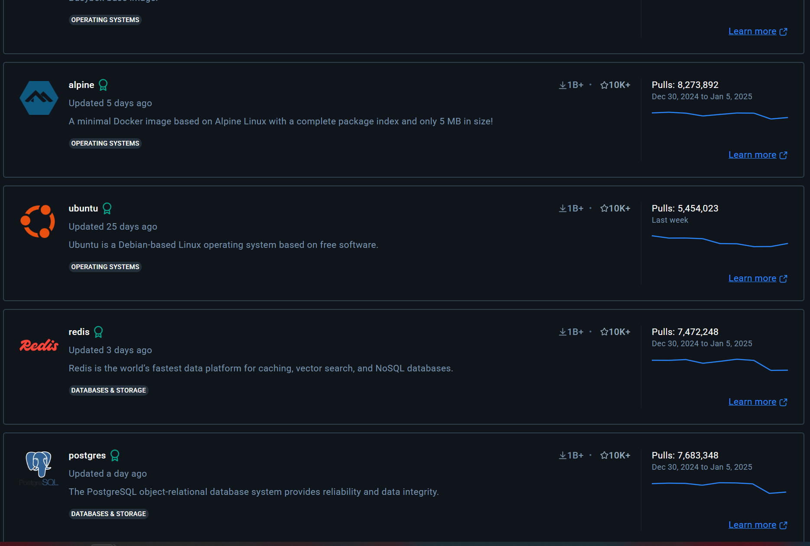
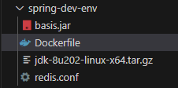
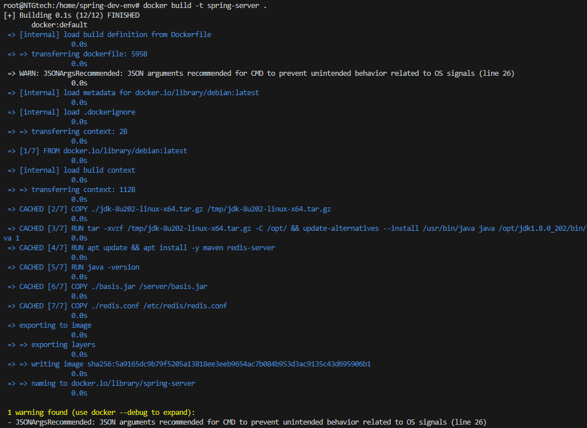

# 快速入门Docker

## 前言


最近在写Java，对方的环境是`Java8` + `Redis` + `MySQL`

因为需要尽可能地快速分发测试环境，为了不去在每个人的电脑上折腾不同的Java版本留存问题 + 四个小时的MySQL导库 + 配置Redis

于是终于想起了轻量好用的`Docker`(究竟是什么原因让我2025年才开始用Docker呢...)

## 虚拟化 vs 容器化

> 省流：Docker使用容器化，比虚拟化的虚拟机启动更快，占用资源更少
{: .prompt-info }

几乎所有介绍都会说到的：


| 特性     | 虚拟化                           | 容器化                     |
| -------- | -------------------------------- | -------------------------- |
| 操作系统 | 每个虚拟机有自己的操作系统       | 容器共享主机的操作系统     |
| 资源占用 | 较高                             | 较低                       |
| 启动速度 | 较慢（分钟级别）                 | 快速（秒级别）             |
| 隔离级别 | 强隔离（独立内核）               | 操作系统级别隔离           |
| 管理工具 | 传统虚拟化管理工具               | Docker、Kubernetes         |
| 典型场景 | 多操作系统环境；运行完整应用程序 | 微服务架构；轻量化应用部署 |

blablabla...

### 举个典型的例子：

Docker提供了许多*官方镜像*：


有Ubuntu，很眼熟，那么和我们虚拟机的Ubuntu有什么区别呢？

Docker 提供的 Ubuntu 镜像是一个**轻量级的文件系统**，包含 Ubuntu 的基本工具和库，但不包含操作系统**内核**或与硬件直接交互的组件

Docker提供的更像是一个**依赖宿主机内核的精简版Ubuntu**

而虚拟机的Ubuntu则是一整个系统

| 特性       | 容器中的操作系统                     | 虚拟机中的操作系统         |
| ---------- | ------------------------------------ | -------------------------- |
| 内核       | 共享宿主机的内核                     | 独立的操作系统内核         |
| 文件系统   | 仅包含最小依赖和工具                 | 包含完整的操作系统         |
| 硬件虚拟化 | 无硬件虚拟化，直接使用宿主机硬件资源 | 通过 Hypervisor 虚拟化硬件 |
| 资源占用   | 极低                                 | 较高                       |
| 隔离       | 操作系统级别隔离                     | 完整操作系统级别隔离       |
| 启动速度   | 秒级                                 | 分钟级                     |

于是不难得出以下结论：

- Docker镜像启动很快
- 占用比虚拟机低很多
- 依赖*Linux内核*，无法运行其他系统内核的操作系统

> 注：你所能看到的可以运行Windows NT的Docker镜像基本都使用了`QEMU`虚拟机


## 安装

不想赘述，Docker Doc比我能写的全面多了：[Portal Here](https://www.docker.com/get-started/)

> 注：Windows建议使用WSL2安装（Docker Desktop本身也是调用WSL2）


# 打包一个环境

要求：
- 使用Debian
- 安装并配置`Redis`, `Java8`
- 从宿主机复制项目
- 导出镜像，做到开箱即用

## 下载官方镜像

这里以 `Debian` 为例

```bash
docker pull debian:latest
```

等待进度条走完，我们就有了一个`debian`镜像

## 前置准备

1. 创建一个文件夹用来存放接下来的文件
2. 复制你需要的文件，这里我将编译好的jar文件、jdk、redis配置文件复制过来


## 创建 Dockerfile

使用Dockerfile来创建镜像，方便复现环境

1. 创建一个文件，名称为`Dockerfile`
2. 输入以下文本，关键词的注释已给出

```dockerfile
# 使用debian为基础
FROM debian:latest

# 维护者名称，这里是你的昵称
LABEL maintainer="ShenNya"

# COPY 可以让你在主机和Docker之间复制文件，./jdk-8u202-linux-x64.tar.gz为刚刚准备的jdk安装包
COPY ./jdk-8u202-linux-x64.tar.gz /tmp/jdk-8u202-linux-x64.tar.gz
 
# RUN 可以在Docker中运行命令，这里运行命令安装java
RUN tar -xvzf /tmp/jdk-8u202-linux-x64.tar.gz -C /opt/ \
&& update-alternatives --install /usr/bin/java java /opt/jdk1.8.0_202/bin/java 1

# 更新源并安装redis
RUN apt update && apt install -y maven redis-server

# ENV 可以快速配置环境变量，这里对java进行设置
ENV JAVA_HOME=/opt/jdk1.8.0_202
ENV PATH="${JAVA_HOME}/bin:${PATH}"

# 测试java
RUN java -version

# 复制jar文件和redis配置
COPY ./basis.jar /server/basis.jar
COPY ./redis.conf /etc/redis/redis.conf

# 我的jar文件是一个开放在8084端口的服务器，所以要将Docker中的8084端口“暴露”出来
EXPOSE 8084

# 运行redis和服务器
CMD redis-server /etc/redis/redis.conf & java -jar /server/basis.jar
```

## 使用 Docker 构建我们的镜像

这里的 `spring-server` 是你想起的镜像名称

```bash
docker build -t spring-server .
```



运行之后它会根据你的 Dockerfile 构建你的镜像，在bash中可以看到进度

如图，没有任何报错之后就成功了

## 测试镜像，运行到容器

使用如下命令来启动你的镜像：

```bash
docker run -p 8084:8084 spring-server
```

`-p 8084:8084` 可以设置对应暴露的端口

`spring-server` 是你的镜像名称


没有任何问题，跑起来了

## 导出镜像，方便迁移

导出：

```bash
docker save -o my-image.tar spring-server
```

`my-image.tar` 是你要导出的文件名

`spring-server` 是你的镜像名称

---

导入：

```bash
docker load -i my-image.tar
```

之后在其他电脑上就可用了！

## 后期管理

```bash
docker run some-image
```
每次使用这条命令后，都会生成一个`容器`, 这个`容器`才是真正在运行的环境

日常需要对容器进行管理

### 查看容器


你可以输入这条命令查看当前的容器：
```bash
docker ps
```
看到的内容是这样的：
```plaintext
CONTAINER ID   IMAGE                                               COMMAND                  CREATED          STATUS          PORTS                    NAMES
2fe65426a0f8   mcr.microsoft.com/devcontainers/jekyll:2-bullseye   "/bin/sh -c 'echo Co…"   23 minutes ago   Up 23 minutes                            eloquent_kepler
fd3357f3f382   spring-server                                       "/bin/sh -c 'redis-s…"   35 minutes ago   Up 35 minutes   0.0.0.0:8084->8084/tcp   reverent_pasteur
```
如`2fe65426a0f8`这样的是容器ID，可以通过它来控制容器的状态

### 停止容器
```bash
docker stop <container_id>
```
### 重启容器

```bash
docker restart <container_id>
```

### 删除不需要的容器

```bash
# 先关停
docker stop <container_id>
# 再删除
docker rm <container_id>
```

### 进入容器进行交互

```bash
docker exec -it <container_id> bash
```

这样会进入到容器中，可以像其他linux系统一样使用它

### 每次运行docker run都删除旧容器
添加`--rm`即可自动删除旧容器

```bash
docker run --rm -p 8084:8084 spring-server
```


# 问题和其他

## localhost问题

在我的例子中，我的`MySQL`运行在主机，服务器运行在`Docker`中

如果`Docker`中的服务器想要连接到`MySQL`，使用`localhost`是 **无法连接** 的

因为此时`Docker`中的 `localhost` 指向了容器内网

对此应当使用

```
host.docker.internal
```

这个地址会自动解析到主机的`localhost`，他是 `Docker` 的默认网桥网络

> 如果想学习更高级的做法，可以使用 `Docker网络` ，本文不做说明


## 运行交互式容器

如果不想写`Dockerfile`，也可以直接运行一个`Debian`容器

`docker run`时使用`-it`即可直接进入容器

```bash
docker run -it --name my-debian-container debian:bookworm bash
```

`docker run`：运行一个新的容器

`-it`：交互模式，进入 Shell

`--name my-debian-container`：为容器起一个名字（可以换成你喜欢的名字）

`debian:bookworm`：使用 Debian 的 Bookworm 版本

`bash`：在容器中运行 Bash Shell

---

