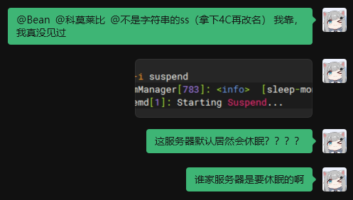

## 起因

服务器连不进去了，为什么呢？


一开始我以为是服务端又`OOM`了，于是我尝试用 `SSH` 链接上服务器


怎么连不上呢？

于是我进到控制面板


这`SLEEPING`...不会真的是休眠吧？

重启后恢复正常


## 发现问题

用 `journalctl` 查看日志：

```bash
# 显示当前的日志
journalctl -xe
# -x 更详细， -e 跳到最新部分

# 查看上一次启动的日志
journalctl -b -1
```

由于我已经重启过了，于是查看上一次日志，查找休眠关键词：

```bash
journalctl -b -1 | grep -i suspend
```

输出如下：

```
root@www:~# journalctl -b -1 | grep -i suspend 
Apr 22 22:59:44 www.ydjstxs.com ModemManager[783]: <info>  [sleep-monitor] system is about to suspend
Apr 22 22:59:44 www.ydjstxs.com systemd[1]: Starting Suspend...
```



不是，谁家服务器要休眠的啊？？？？

## 解决方法

1. 修改配置文件

```bash
sudo vim /etc/systemd/logind.conf
```

取消下面几项的注释并修改为对应的内容：

```ini
[Login]
HandleLidSwitch=ignore
HandleLidSwitchDocked=ignore
HandleSuspendKey=ignore
HandleHibernateKey=ignore
IdleAction=ignore
IdleActionSec=0
```

退出重启
```bash
sudo systemctl restart systemd-logind
sudo reboot
```

2. 彻底禁用`suspend`

```bash
# 禁用
sudo systemctl mask sleep.target suspend.target hibernate.target hybrid-sleep.target
# 启用
sudo systemctl unmask sleep.target suspend.target hibernate.target hybrid-sleep.target
```

