## 前言 & 吐槽

40GB的内存不够了（感谢win11把各种软件往里面预载真是烦得要死）

550RMB买了根新的 `英睿达 DDR5 5600 32G` 内存然后买到假货了

不是大哥，550你跟正品就差30块，你个假的还卖那么贵真的是祖上没人了

Anyway这篇主要还是说一下鉴别仿品的方法

## 鉴别方法

### 不要买所谓的 *散装* 内存

一开始到手上的假货内存是这样的，商家说是散装的才会是这样的包装：

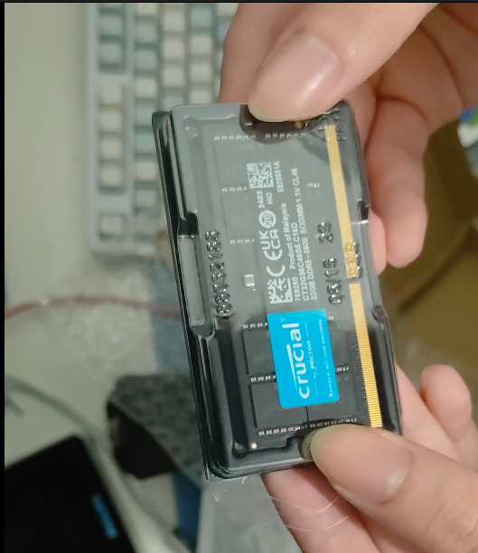

就一个简单的小盒子，什么都没贴

假货：

内存背面有商家的防拆贴，正品是没有的

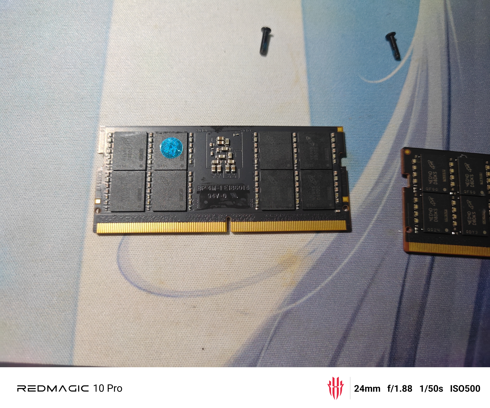

---

真的全新零售英睿达内存是有防拆的小盒子的

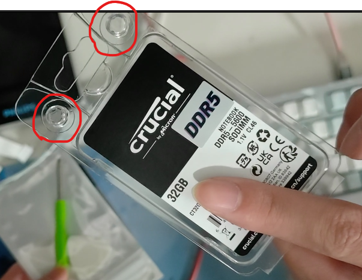

红圈圈起来的地方是打开就会坏的一次性卡扣

盒子正面也有标签

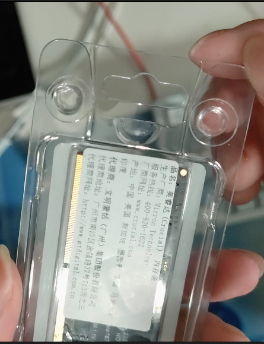

盒子背面一般有代理商的热敏纸

正品内存的背面是这样的：

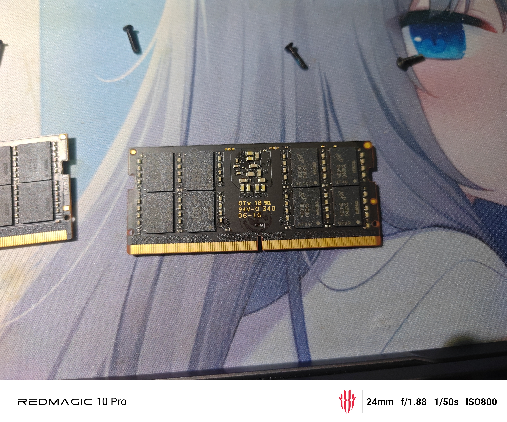

### 官网查料号

打开这个 **质保网址** :

[https://crucial.cn/warranty-home](https://crucial.cn/warranty-home)

看着你的内存标签

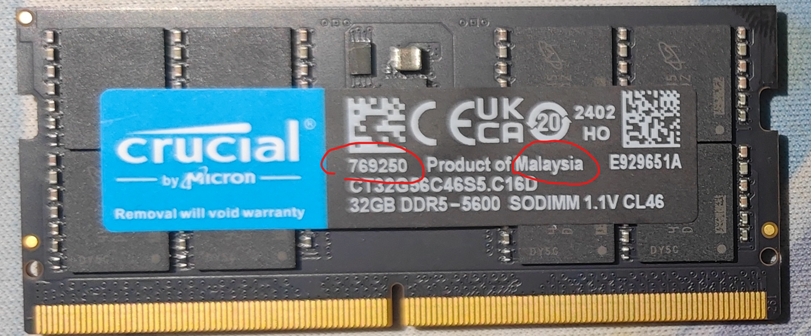

左边红圈(二维码下方)里的数字是 **料号**

右侧红圈(Product of xxxx)里的地区是 **国家或地区**

回到质保页面，输入 `国家或地区`

`What are you validating ?`选择`DRAM`

`材料编号` 输入 `料号`

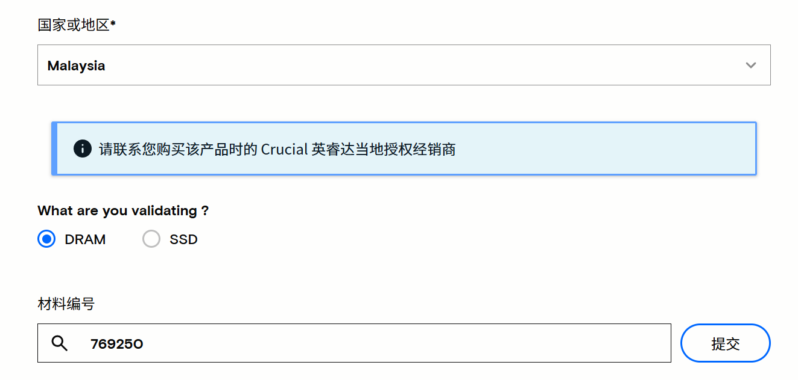

点击提交

---

假货：

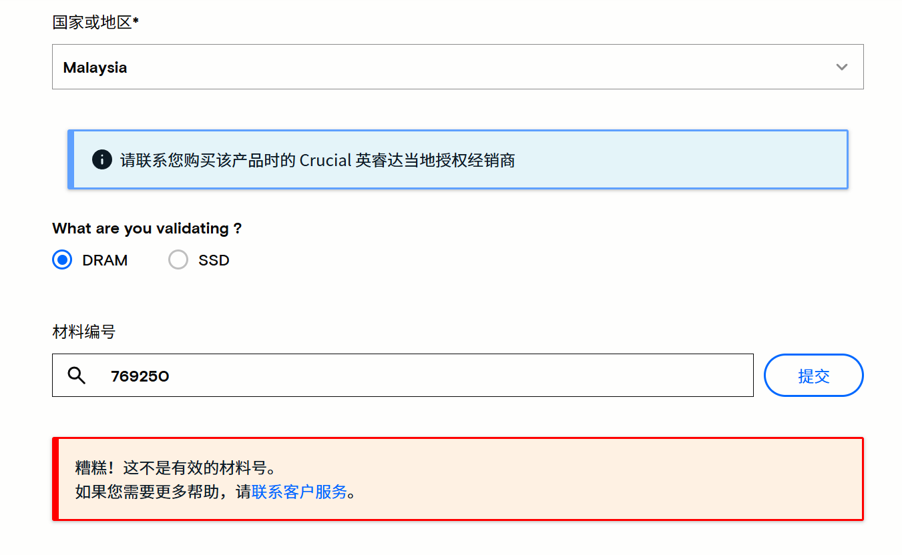

---

真货：

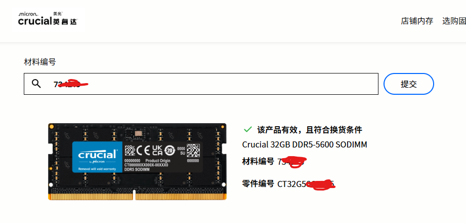

---

但是这种想要造假也很容易，复印标签就可以了

### 看颗粒

英睿达用的美光颗粒一般都会有生产时方便溯源的 `二维码`

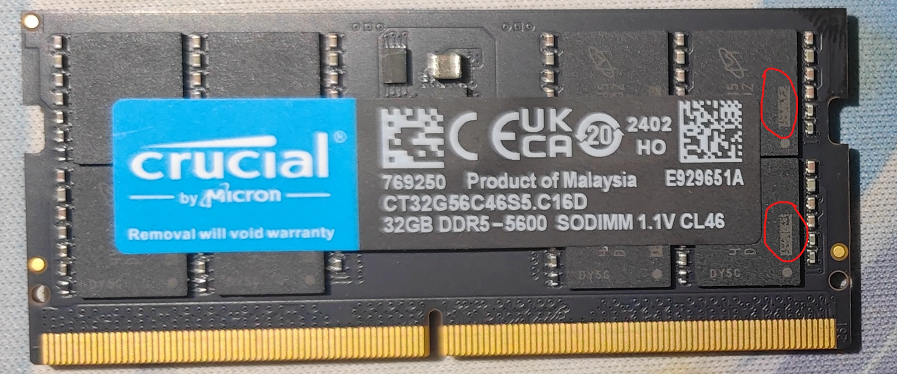

就是这些方块上的点阵图

这些二维码机器是要扫出来的，所有不可能糊在一起

---

假货：

都糊成一坨了

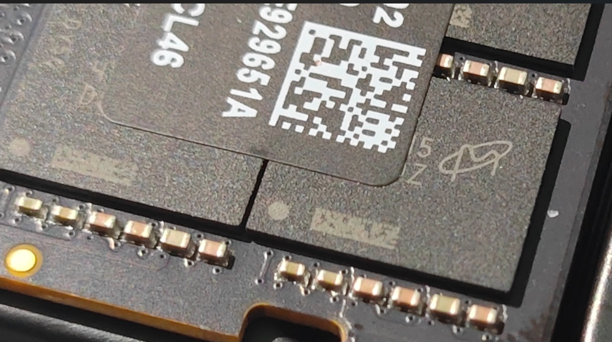

---

正品：

粒粒分明

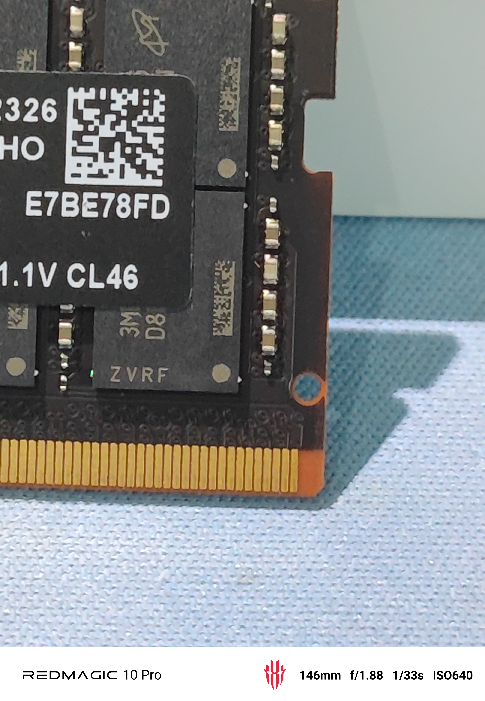

---

到这里就可以确认我手上的内存条是假货了

但是我还是很好奇，于是开机看看

### 机内型号

一般来说，奸商刷`SPD`信息会很麻烦，所以序列号什么的很多都是重复的，或者是和标签对不上的

装上电脑，开机倒是很顺利

电脑上下个`CPU-Z`，打开`SPD`

查看型号对不对

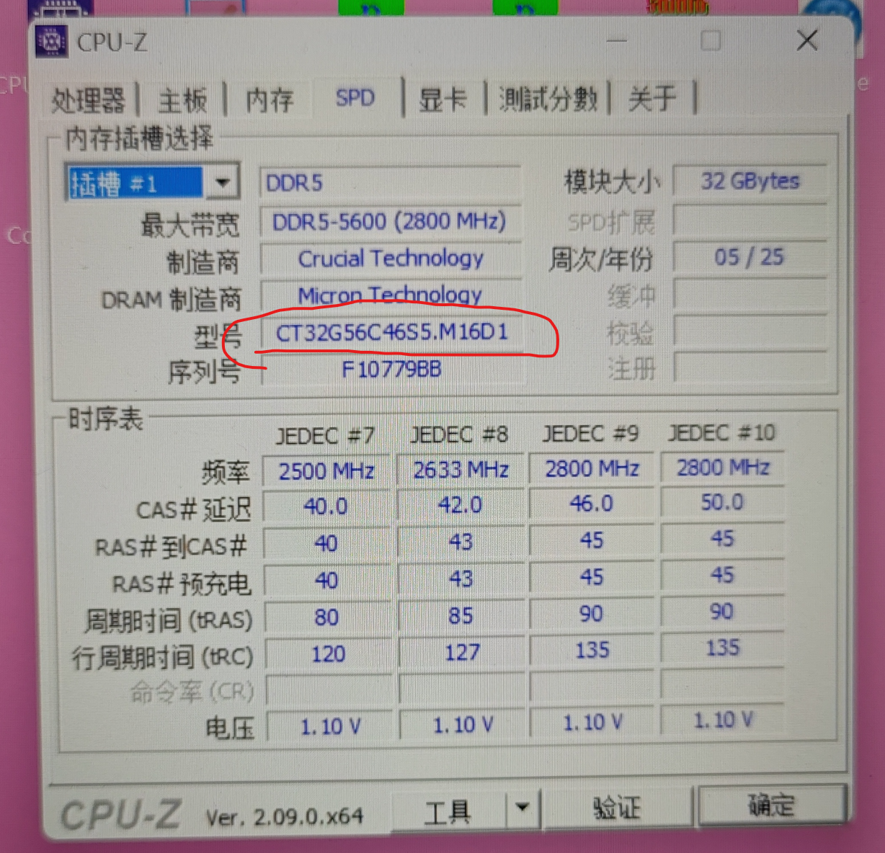

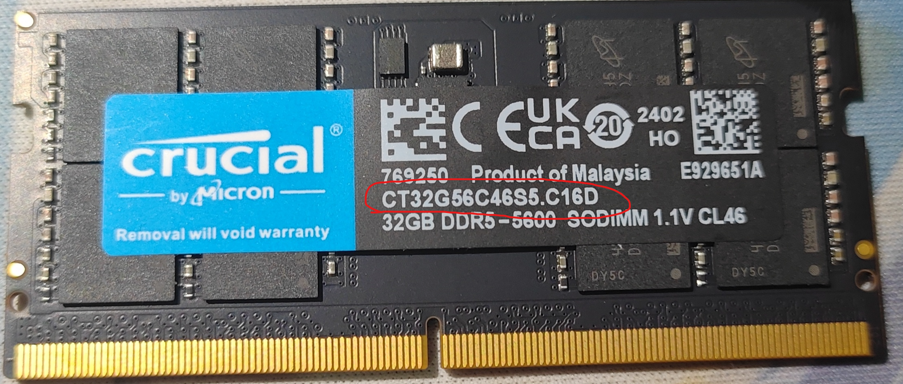

`C16D`怎么变成`M16D1`了？

到这里我就直接退货了

### 标签

首先就是去评论区看，统一规格的内存有没有完全一致的标签，有就是假货

其次就是到手看标签的质感

这个很难看出来，我在这里放张对比图

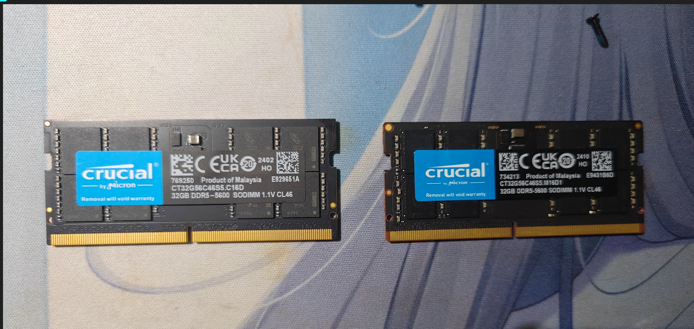

首先是上手的观感

正品的标签像是`带背胶塑料纸`，LOGO的蓝色涂抹的很均匀

假货的标签像是`过塑纸`，LOGO的蓝色会随着纸张粗糙程度有不同的深浅（拍不出来，但是上手感觉明显）

然后是这个假货的logo

假：

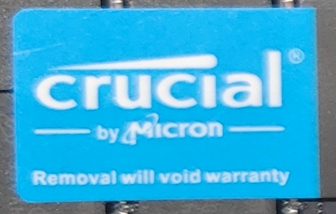

真：

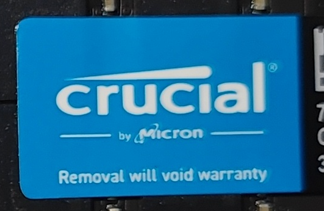

假货的P图水平不是很好，LOGO放的太大了

## 结尾

目前我找到的方法就这些

这件事让我很恼火的点在于他卖的价格完全不便宜

你要是260卖我假货我也就忍了，毕竟就这个价格

但是你卖550？？？？

授权店叠张券的价格就能买的东西我为什么要花大价钱和你一个假货扯皮？
